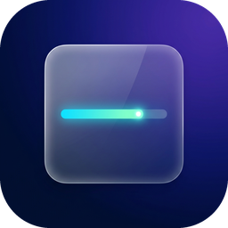
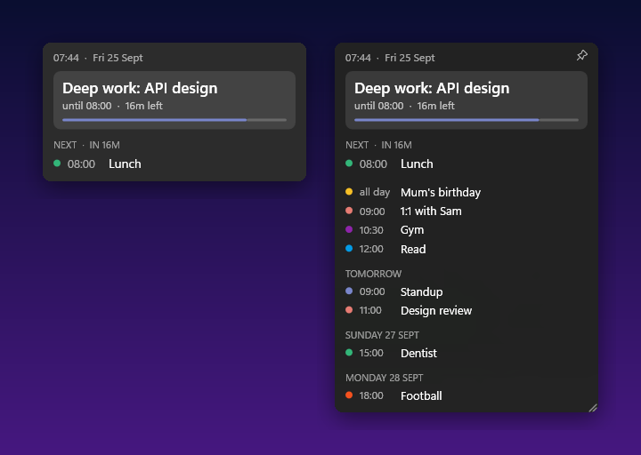
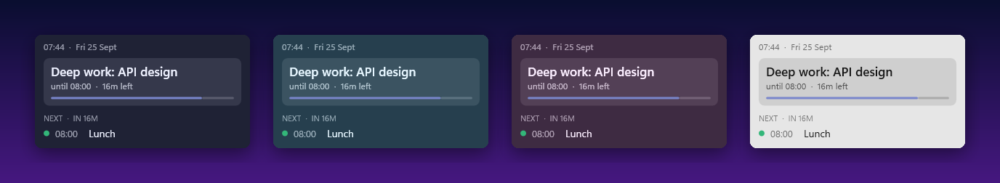
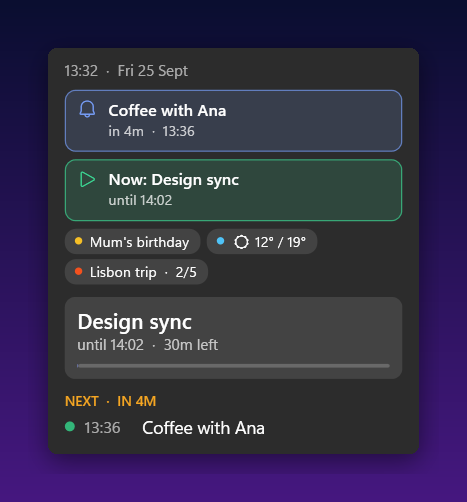

<p align="center">
  
</p>

<h1 align="center">Glance</h1>

<p align="center">
  A tiny floating Google Calendar widget for Windows 11.<br>
  What you should be doing <b>now</b>, what's <b>next</b>, and the rest of your week on hover.
</p>

<p align="center">
  <a href="https://github.com/BosTheCoder/glance/releases/latest"></a>
  <a href="https://github.com/BosTheCoder/glance/actions/workflows/build.yml"></a>
  
  
  <a href="LICENSE"></a>
</p>

<p align="center">
  
</p>

## Features

- **Now and next at a glance.** A card for the current event with a time-left bar, plus the next event and a countdown.
- **All-day events as chips** under the clock (weather, birthdays, trips with "day 2/5"), visible without hovering.
- **Sleek alerts inside the widget**, not Windows toasts: amber when things are about to change, a green ▶ banner when an event starts, and a blue 🔔 banner for the event's own Google reminders. See [Alerts](#alerts).
- **Hover to expand** into a scrollable agenda for the days ahead. When you move away it shrinks back and the scroll resets.
- **Fades when idle.** It's see-through while you work and turns solid when you hover it.
- **Acrylic glass** in 7 themes, three glass strengths and any custom colour.
- **Drag to move, drag the corner to resize.** It can be pinned on top and it remembers where you put it.
- **You pick the calendars**, and changes you make in Google show up within a minute.
- **Portable.** One `.exe` and nothing to install. Its settings live in a JSON file next to it.

## Install

1. Download **`Glance.exe`** from the [latest release](https://github.com/BosTheCoder/glance/releases/latest). It needs the [.NET 8 Desktop Runtime](https://dotnet.microsoft.com/download/dotnet/8.0). If you don't want to install that, use `Glance-standalone.exe` instead (≈70 MB, no runtime needed).
2. Put it in a folder of its own, for example `C:\Apps\Glance\`.
3. Add a Google OAuth client as `client.json` next to it. It takes about 5 minutes: **[docs/google-setup.md](docs/google-setup.md)**.
4. Run it. Your browser opens for sign-in, and after that the widget fills in.

Want to try it without Google first? Run `Glance.exe --demo`.

## Using it

| Do this | To |
| --- | --- |
| Hover | Expand the agenda and make the widget solid |
| Drag anywhere | Move it |
| Drag the bottom-right corner | Resize the width, and the list height while expanded |
| Click the pin | Keep it on top of other windows |
| <kbd>Win</kbd>+<kbd>Shift</kbd>+<kbd>G</kbd> | Hide or show it from anywhere (change it in the menu). Running `Glance.exe` again also brings it back |
| Right-click | Open settings: calendars, theme, glass, idle opacity, text size, how many events, how far ahead, 12/24h, refresh rate, taskbar, start with Windows, hide/show shortcut |

<p align="center"></p>

## Alerts



| Colour | Means | Goes away |
| --- | --- | --- |
| **Amber** countdown and edge | What you're doing changes within 5 min (current event ends or the next one starts) | When the change happens |
| **Green ▶ Now: …** | An event just started | Once you've hovered the widget |
| **Blue 🔔** | One of the event's own reminders (the popup reminders you set in Google Calendar) | Click it, or when the event starts |

While an alert is showing, the widget stays fully visible. If it was hidden, it comes back. Reminders play the Windows notification sound, and you can turn that off. Everything is under right-click → **Alerts**, including **Preview alerts** so you can see them.

<br clear="right">

Every option is also in `settings.json`, and edits to it apply live. See **[docs/settings.md](docs/settings.md)** for the full list, including custom colours.

## Develop

```powershell
git clone https://github.com/BosTheCoder/glance && cd glance
dotnet run -- --demo          # fake events, no Google account needed
```

To build on Linux or WSL, and for the code layout and release process, see **[docs/development.md](docs/development.md)**.

## Privacy

Glance asks only for the read-only calendar scope (`calendar.readonly`) and talks only to Google. Your refresh token stays on your machine, encrypted with Windows DPAPI for your user account.

## Licence

[MIT](LICENSE)
